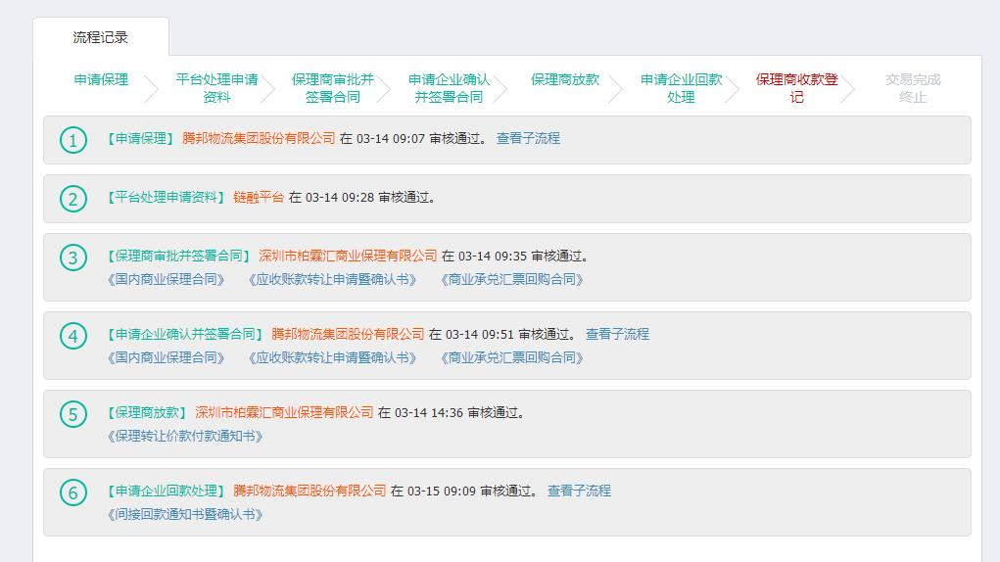
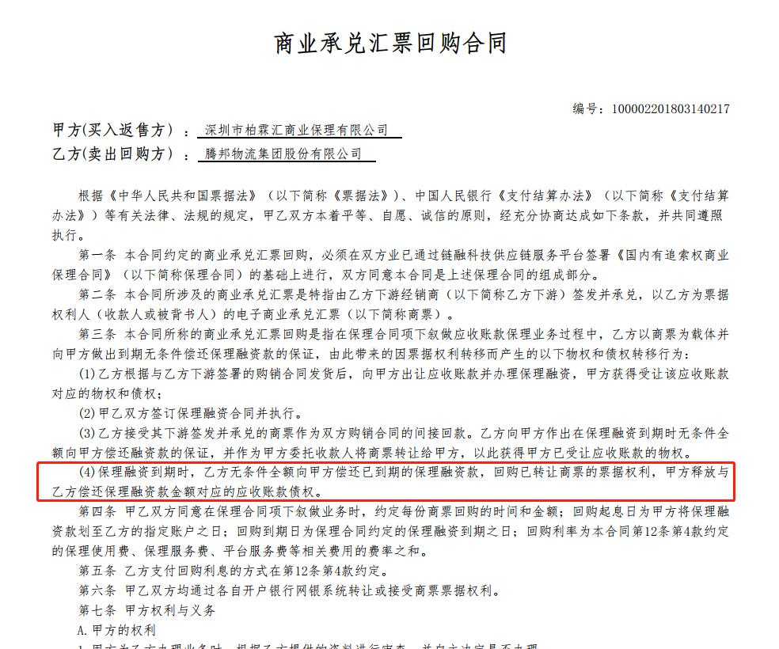
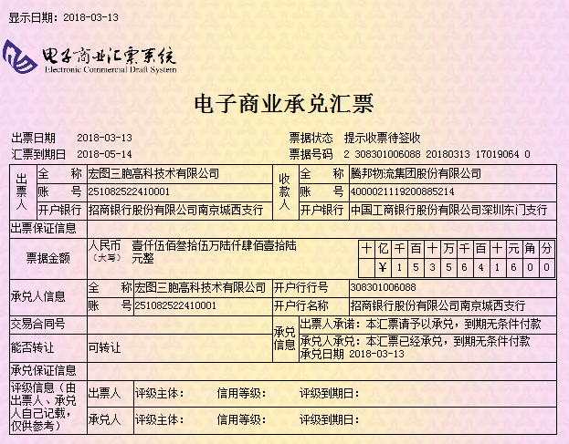

# 基础模式

> ### **业务背景:** 通过两票一合同（商票、发票、合同）的方式，基于真实的交易背景，解决下游采购商的融资问题，

> ### **参与方:** 核心企业，供应商，保理商，平台

> ### **参与方作用:** 
> 1.核心企业：拿下游采购商开出的商票到保理商进行保理，商票到期后将商票进行回购。  
> 2.下游采购商：给核心企业开商票  
> 3.保理商：提供给下游采购商保理  
> 4.平台：核心企业提供的保理资料

> ### **业务场景:**  某下游采购商跟核心企业买了一批苹果手机，价值1个亿，核心企业将手机运给了下游采购商，下游采购商给核心企业开了一张半年后兑付的商票。因为是下游采购商开的票，所以下游采购商拿票到保理商融资的时候，就需要核心企业进行兜底，然后保理商把款打给下游采购商，商票到期的时候，核心企业将商票进行回购。

> ### **业务流程：** 
> 

> ### **主流程** 
>> 授信 -> 出票登记 -> 平台审核出票登记
>>> 申请保理 -> 平台处理申请资料 -> 保理商审批并签署合同 -> 申请企业确认并签署合同 -> 保理商放款 -> 申请企业回款处理 -> 保理商收款登记 -> 交易完成

> ### **回购合同** 
> 

> ### **回购商票** 
> 