# 万科abs模式通用组件
##### **流程记录**
>
> **描述：**  `FlowProcessComponent` `路径：(src/app/public/flow/flow-process.component.ts)`中进行配置，流程步骤进度在
> `XnFlowUtils` `路径：(src/app/common/xn-flow-utils.ts)`组件中的`calcFlowProcess(flowId: string)`方法中根据流程id`flowId`配置。
>
> **截图：**
>
> 
>
##### **所在页面：** 万科模式-记录列表
>
> **组件：**  `DataTable` `路径：(src/app/common/data-table.ts)` ,`RecordComponent` `路径：(src/app/pages/console/record/record.component.ts)`
>
> **描述：**  流程记录，点击 `查看处理`,`标题` 可进入下一阶段（复核），`发起申请交易`按钮进入预录入页面，按钮内容在 `Tables` `路径：(src/app/config/tables.ts)` 根据 `flowId`在 `flow`对象中配置。
>
> **截图：**
>
> 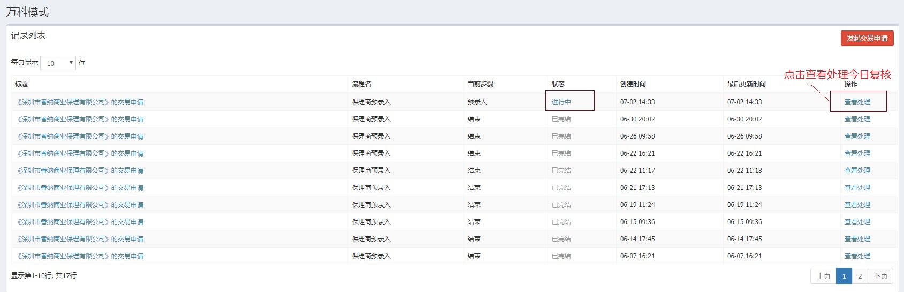
>
#####  **所在页面：** 保理商预录入
>
> **type:** `select`
> 
> **描述：** 选择核心企业
> 
> **截图：** 
> 
> 
>
> **type:** `data-content`
>
> **描述：** 下载摸板，补充数据并上传保理计划表（excel），并解析表格数据显示在table中,表各种可根据特定尺寸，横向，纵向拖动查看。
>
> **截图：**
>
> 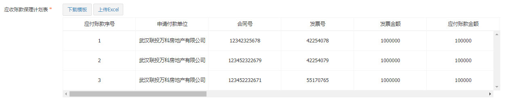
>
> **type:** `textarea`
>
> **描述：** 文本域输入
>
> **截图：**
>
> 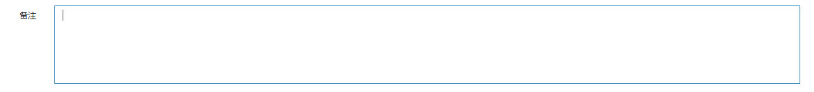
>
> ##### **所在页面：** 保理商预录入-复核
>
> **type:** `select`
>
> **描述：** 仅显示提交的值，不可编辑
>
> **截图：**
>
> 
>
> **type:** `data-content`
>
> **描述：** 仅显示上一步解析的数据
>
> **截图：**
>
> 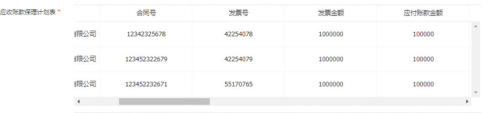
>
> **type:** `textarea`
>
> **描述：** 仅显示上一步解析的数据
>
> **截图：**
>
> 
>
> **描述：** 点击 `提交`按钮进入下一流程 `供应商上传资料并签署合同`
>
>##### **所在页面：** 供应商所有代办任务
>
> **组件：** 如上 `万科模式-记录列表`
>
> **描述：** 点击处理或标题进入上传资料页面
>
> **截图：**
>
> 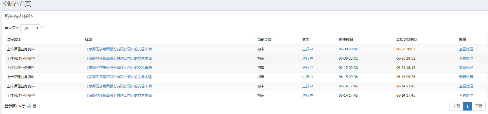
>
>##### **所在页面：** 供应商上传资料并签署合同
>
> **type:** `picker`
>
> **描述：**  在此业务阶段该项为默认后台配置，不可编辑 (即该`checker`项`value`有默认值，且可选项`options`中设置`readonly:true`)，以下不可编辑状态都以此方法设置。
>
> **截图：**
>
> 
>
> **操作：** 点击选择按钮，弹出选择列表框
>
> **截图：**  `举例可编辑`
>
> 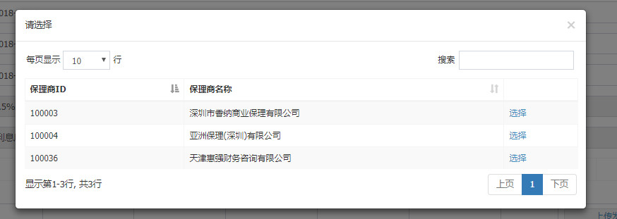
>
> **type:** `text`
>
> **描述：** 普通文本框，此处业务为默认不可编辑，同上 `picker`
>
> **截图：**
>
> 
>
> **截图：** `举例可编辑`
>
> 
>
> **type:** `date`
>
> **描述：**  日期选择空间，此处为不可编辑。该空间默认选择当天日期
>
> **截图：**
>
> 
>
> **编辑状态：**
>
> 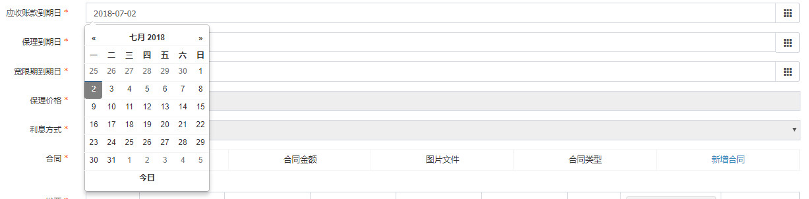
>
>
> **type:** `contract-vanke`
> 
> **描述：** 根据默认合同编号补充合同基本信息，
>
> **截图：**
>
> 
>
> **操作：**  点击`补充`按钮，弹出合同信息补充弹框，点击 `文件` 可查看合同文件信息,再次点击`补充`可修改补充的信息
> 
> **截图：**
>
> 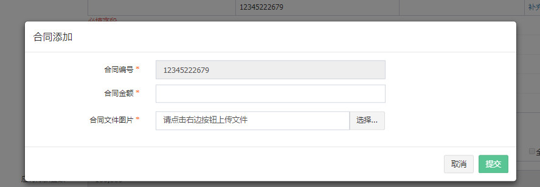
>
> 
>
> 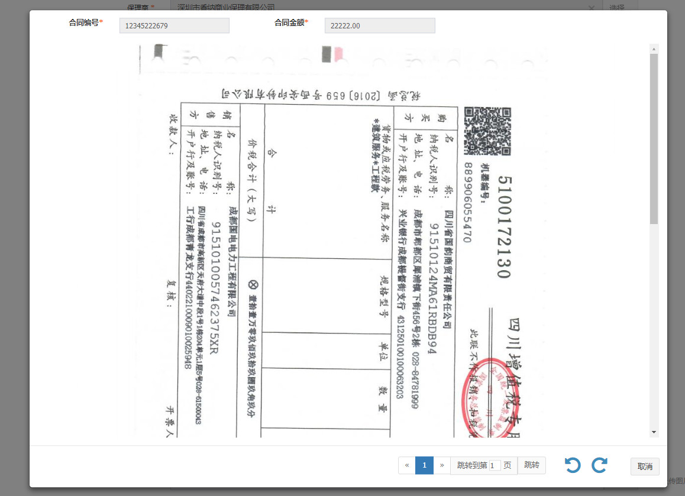
>
> **type:** `pre-invoice`
>
> **描述：**  显示预录入发票及上传状态，根据 发票上传验证组件来改变状态,并计算发票金额总额
>
> **截图：**
>
> 
>
> 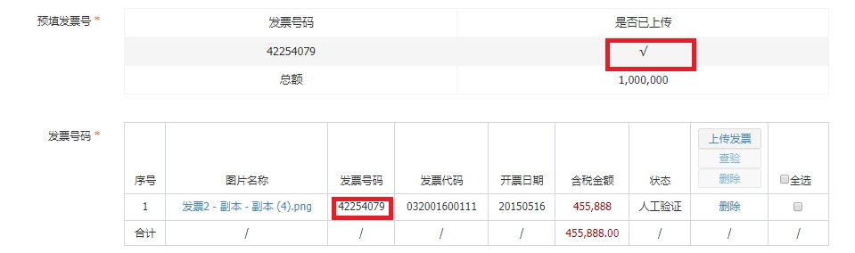
>
> **type:** `invoice-vanke`
>
> **描述：**  上传发票并查验（包含图片验证，和人工验证），批量上传前对图片进行MD5加密，进行过滤去重，当图片验证(`金蝶验证`)失败,可进行`手工查验`，并显示状态为`人工查验`。手工验证发票验证失败，手工录入函数金额。
>
> **操作：** 
>   1. 可批量上传、删除、图片查验，也可单张查验、删除。
>   2. 查验成功时隐藏查验功能。
>   3. 查验完成后自动计算函数金额。
>   4. 点击图片名称可查看发票信息。
> 
> **截图：**
> 
> 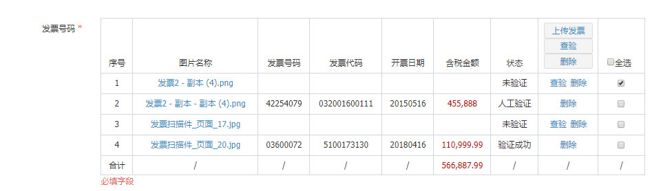
> 
> **人工查验：**
>
> 
>
> 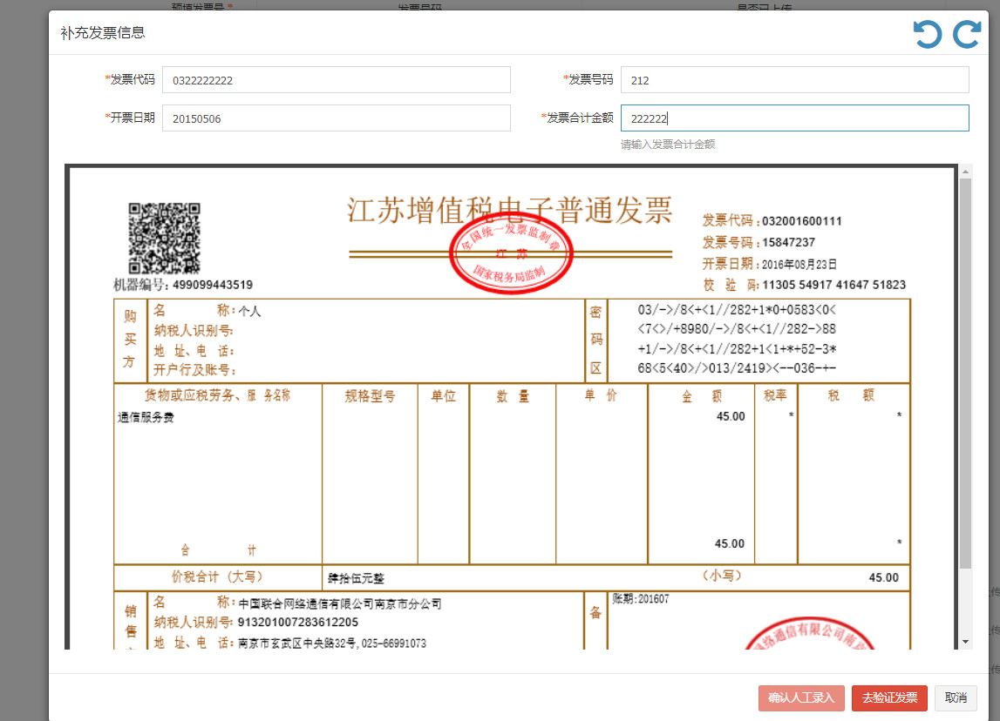
>
> **人工查验失败：**
> 
> 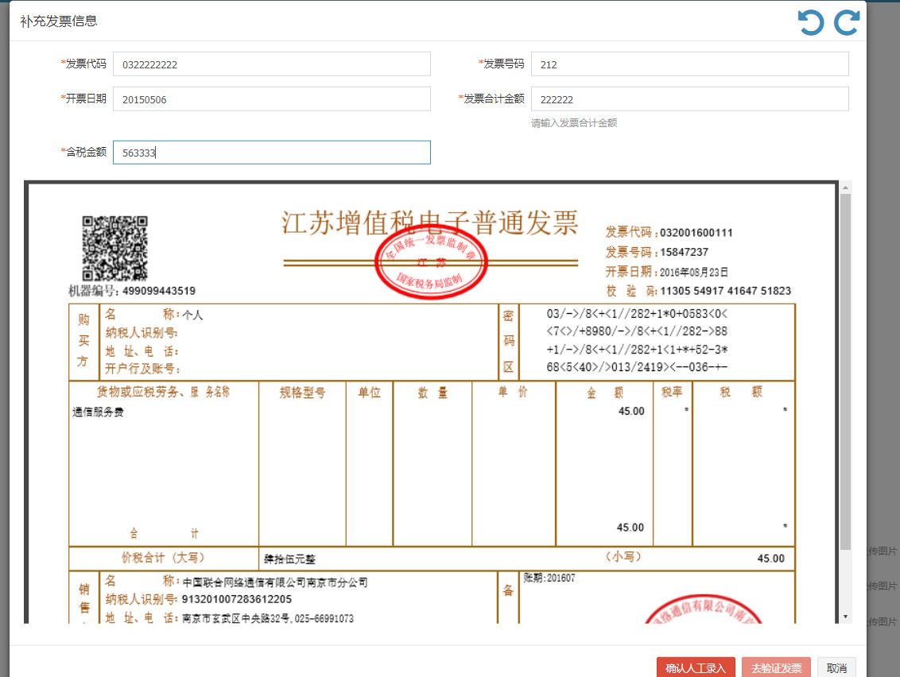
>
> **type:** `money`
> 
> **描述：**  该组件在此业务为不可编辑状态。输入金额可对数字进行三位分割格式化，并显示中文大写金额。
> 
> **截图：**
>
> 
>
> **可编辑状态：**
>
> 
>
> **type:** `mfile`
>
> **描述：** 可多张上传图片，并对图片进行压缩
>
> **操作：** 点击 `选择`按钮上传本地图片文件，点击文件名可查看文件，并可旋转保存文件
> 
> **截图：**
> 
> 
>
> **上传完成：**
>
> 
>
> **查看文件：**
>
> 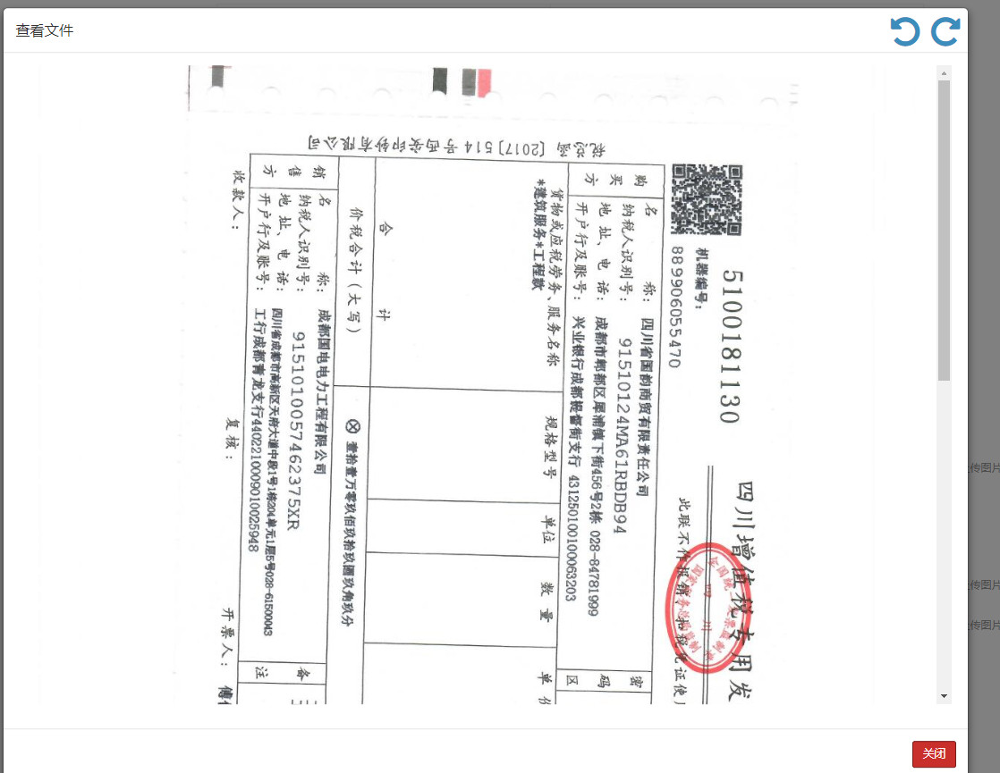
>
> ###### **提交**
> **操作：** 点击 `提交`按钮进入复核页面
> 
> **type:** `contract-vanke`
>
> **描述：** 展示合同信息 
>
> **操作：** 点击文件查看合同信息
> 
> **截图：**
> 
> 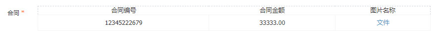
>
> **type:**  `invoice-vanke`
>
> **描述：**  展示上部提交发票列表信息，并计算总额，点击图片名称可查看发票信息
>
> **截图：** 
> 
> 
>
> **type:**  `mfile`
>
> **描述：**  展示多选上传图片文件，点击文件名可查看文件信息
>
> **截图：** 
> 
> 
>
> 
> **操作：** 
>  1. 点击 `拒绝` 按钮可以回退到上一步骤。
>  2. 点击 `同意`，生成合同，并签署盖章。
>
> **截图：** `回退`
> 
> 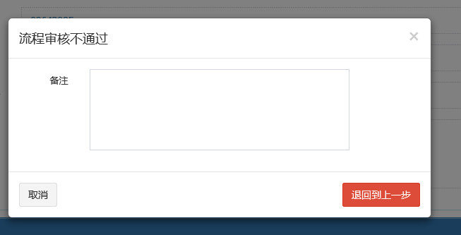
> 
> **合同生成并签署：** 
>  1. 在 `IFlowCustom` `路径：src/app/pages/console/record/flow.custom.ts` 根据`flowId`配置当前 `Financing6Flow` `路径：src/app/pages/console/record/custom/financing6.flow.ts` 流程。
>  2. `Financing6Flow`组件中 `preSubmit(svrConfig: any, formValue: any)`方法中加入合同获取api `api/record/record?method=pre_submit`
>  3. 打开合同查看、签署组件 `FinancingFactoringVankeModalComponent` `路径：src/app/public/modal/financing-factoring-vanke-modal-component.ts`，默认渲染第一份合同内容
>  4. 点击 `阅读并盖章`签署合同，当左侧合同列表，全部勾选签订完成 点击`完成`到下一流程。
>  
>  **截图：** `同意`
> 
> 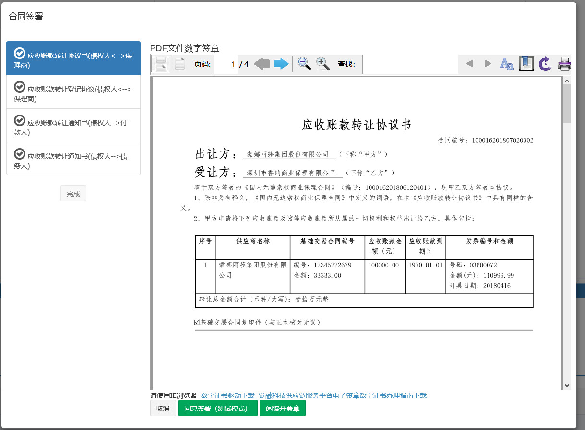
>
>##### **所在页面：** 保理商审核并签署合同
>
> **描述：** 展示上一步供应商签署的合同 。组件 `ContractComponent` `路径：src/app/pages/console/record/contract.component.ts`
>
> **操作：** 点击合同名称，查看合同，`PdfSignModalComponent` `路径：src/app/public/modal/pdf-sign-modal.component.ts`
>
> **截图：**
>
> 
>
> **type:** `contract-office`
>
> **描述：** 显示合同信息，并补录合同类型，可修改合同类型
>
> **操作：** 点击 `补录`按钮，弹出合同补录弹框 `ContractVankeEditModalComponent` `路径：src/app/public/modal/contract-vanke-edit-modal.component.ts`
>
> **截图：**
>
> 
>
> **补录类型：**
>
> 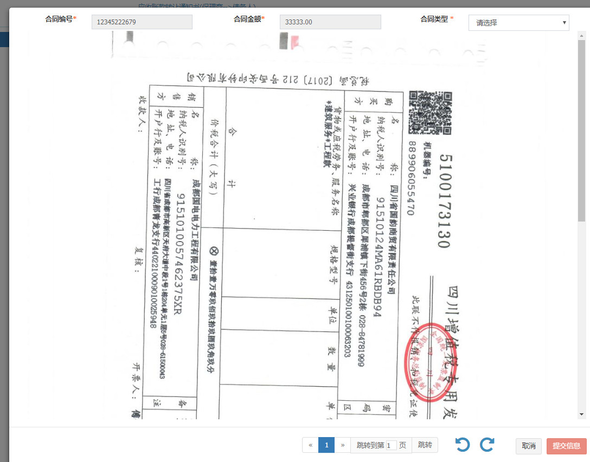
>
> **补录完成：**
>
> 
>
>##### **保理上复核**
>
> **操作：**  点击 `同意` 同意按钮，获取供应商签署的合同，并查看签署。`IFlowCustom` 中配置流程信息，`FinancingSupplier6Flow` `路径：src/app/pages/console/record/custom/financing-supplier6.flow.ts`，`preSubmit(svrConfig: any, formValue: any)`获取合同信息。在`FinancingFactoringVankeModalComponent`
>
>##### **所在页面：** 上传付款计划-万科模式列表
> 
> **描述：** 申请信息 `登记编码、修改码` 补全，`出让人信息表`
> 
> **截图：** 
>
> 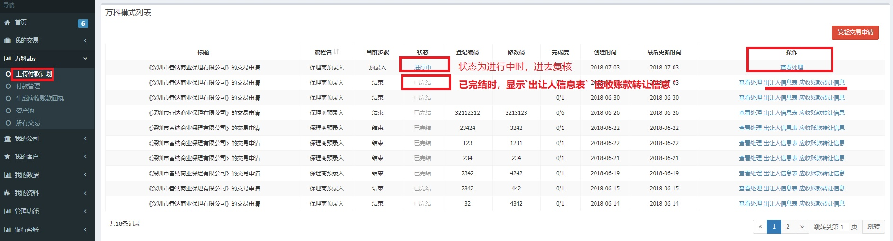
>
>#####  **出让人信息登记：**
> 
> **type:** `assignor-info`
>
> **描述：** 上传文件对应出让人信息，验证是否一致
>
> **截图：** 
>
> 
>
> **type:** `assignor-info`
>
> **截图：** 复核展示信息 
>
> 
>
>#####  **应收账款转让信息：**
>
> **描述：** 补充 `登记编码、修改码`
>
> 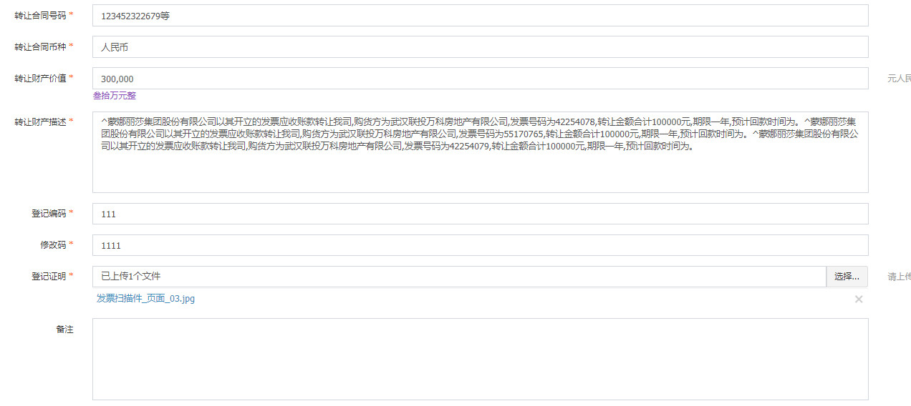
>
>#####  **付款管理：**
> 
> **组件：** `PaymentComponent` `路径：src/app/pages/console/manage/payment.component.ts` 
> 
> **描述：** `未付款确认(上传付款确认书)`=》`未打印付款确认(打印)`=》 `已打印待放款(上传汇款凭证)` =》`已放款(上传实际付款确认书*如需更正)`
>
> **操作：**  点击 `点击上传`跳转至上传付款确认书页面
>
> **截图：**
>
> 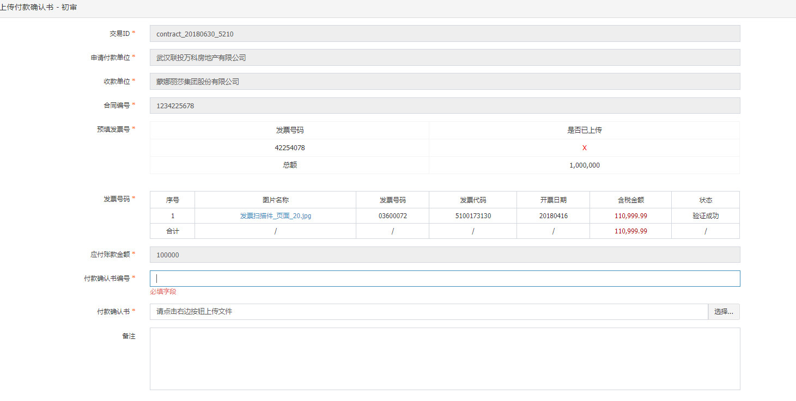
>
> **描述：** 选择交易并批量打印，并添加 `起息日期`
>
> 
>
> 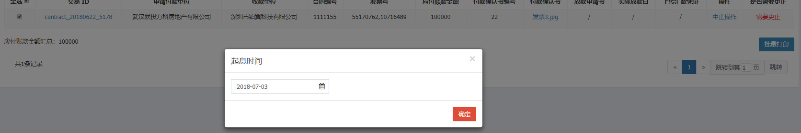
>
> **描述：** 已打印待放款，上传 `上传汇款凭证`
>
> 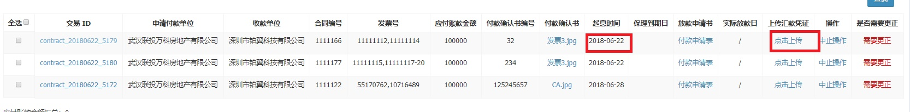
>
> 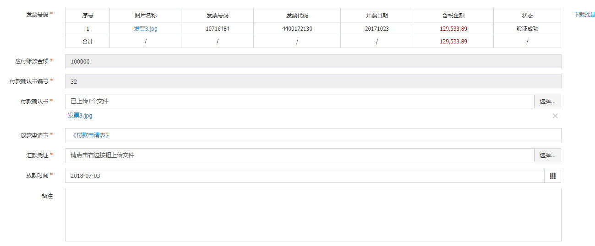
>
> **描述：** 如 `需要更正` `上传实际付款确认书`，同 `上传付款确认书(新增，不覆盖原来上传)`
>
> 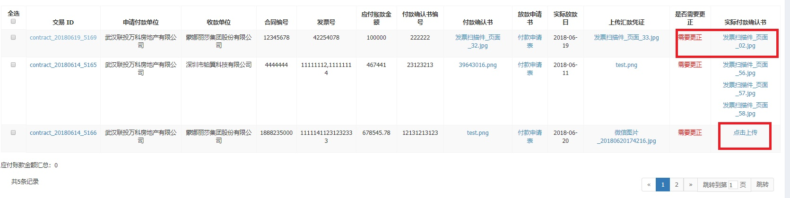
>
> 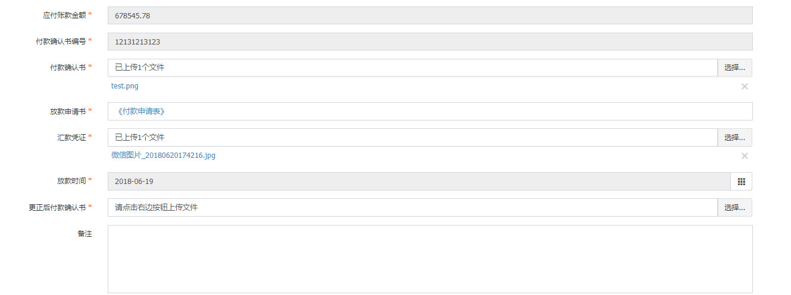
>
> ##### **所在页面：** 资产池
>
> **描述：** 针对万科模式交易单的资产打包
> 
> **操作：**
> 1. `添加` 新增资产池，`下载Excel` 万科模式没有录入资产池的数据
> 2. `查看` 查看该资金池的所有交易单
> 3. `添加` 添加交易单到该资产池
> 4. `移除` 移除该资金池的某笔交易单
> 5. `锁定` 不可修改该资金池内容
>
> **组件：** `查看` `添加` `移除` 跳转至   `CapitalPoolCommListComponent` `路径：src/app/public/component/capital-pool-comm-list.component.ts` ` buildParams()`方法中配置参数。`查看` 和 `移除` 根据资产池`id`查询。`添加`根据 交易模式 `3 or 6` 和`是否是资金池`查询。
>
> 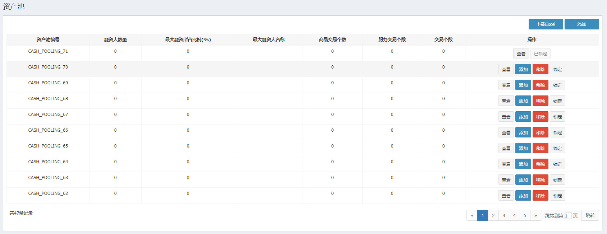
>
> **描述：** 查看该资金池内容
>
> **截图：**
> 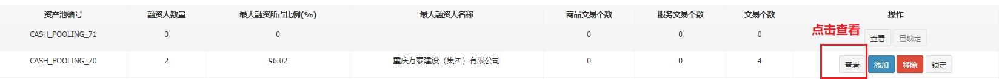
> 
> **组件：**
> 
> 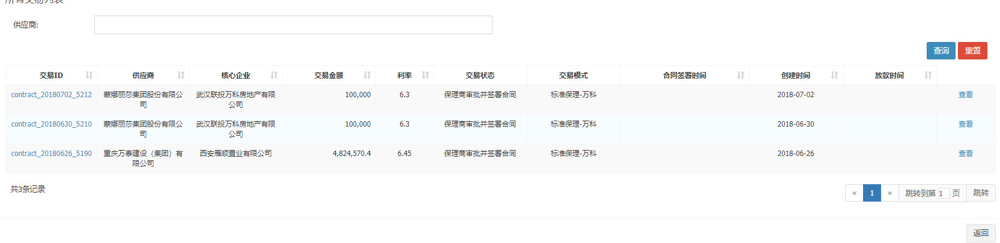
>
> **描述：** 添加交易至该资金池
>
> **截图：**
> 
> 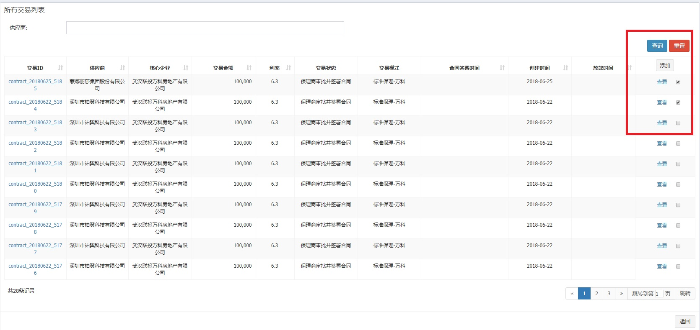
>
> **描述：** 移除资金池中的交易
>
> 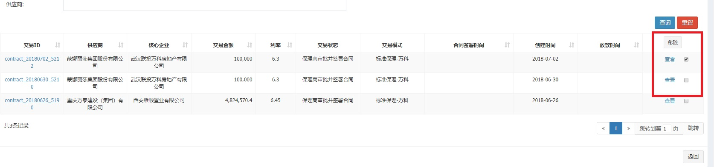
>
> **描述：** 锁定该资金池后，只可查看
>
> 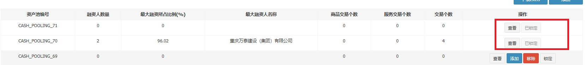
>
> ##### **所在页面:** 生成应收账款回执-world下载列表
>
> **描述：** 展示所有交易，并生成word文件
>
> **操作：** 
> 1. `下载付款计划表摸板`,下载标准摸板，补充数据后 `上传Excel`
>
> 
>
>
> 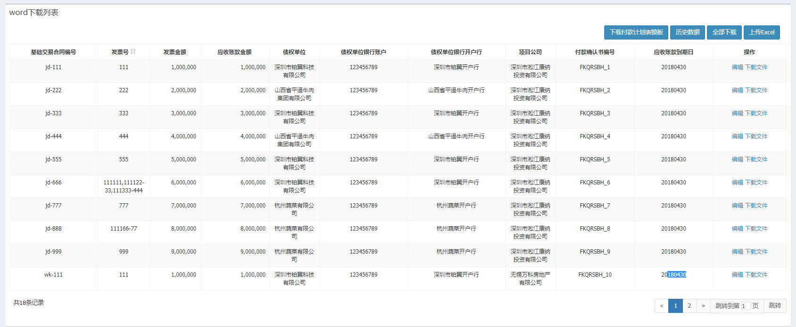
>
>
>
>
>
>

