# 链融网站通用组件

> **type:** contract
> 
> **描述：** 新增合同（可以新增和删除，不能补录）
> 
> **关键字：** 合同，新增，删除
> 
> **所在页面：** 核心企业出票登记、基础模式+委托模式+回购模式，发起交易
> 
> **截图：** 
> 
> 
> 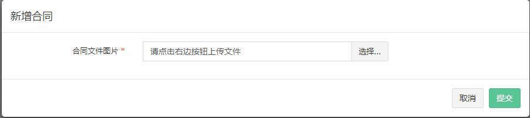
> 

> **type:** mfile
> 
> **描述：** 上传多文件（仓单运单至少选一个，在validators里面配置{"mustOne":["invoiceFile"]}，在options里面配置{"fileext": "jpg, jpeg, png, pdf", "picSize": "500"}，可以配置上传的类型，可以设置图片的压缩率）
> 
> **关键字：** 文件、上传
> 
> **所在页面：** 核心企业出票登记、基础模式+委托模式+回购模式，发起交易
> 
> **截图：** 
> 
> 
> 

> **type:** invoice
> 
> **描述：** 上传发票，在options里面配置，mode为upload，就是可以上传，如果为edit就是可以编辑。可以配置是否支持多张上传，可以配置上传的图片格式，图片的压缩率。{"mode":"upload","multi":true,"fileext": "jpg, jpeg, png","picSize":"500"}
> 
> **关键字：** 发票、上传、编辑
> 
> **所在页面：** 核心企业出票登记、基础模式+委托模式+回购模式，发起交易
> 
> **截图：** 
> 
> 
> 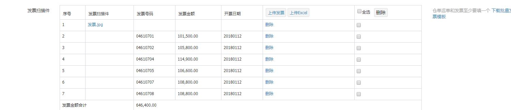

> **type:** honour
> 
> **描述：** 新增商票，在options里面配置，该checker项的mode，是否支持多张上传{"mode":"upload","multi":true}
> 
> **关键字：** 发票、上传、编辑
> 
> **所在页面：** 核心企业出票登记、基础模式+委托模式+回购模式，发起交易
> 
> **截图：** 
> 
> 
> 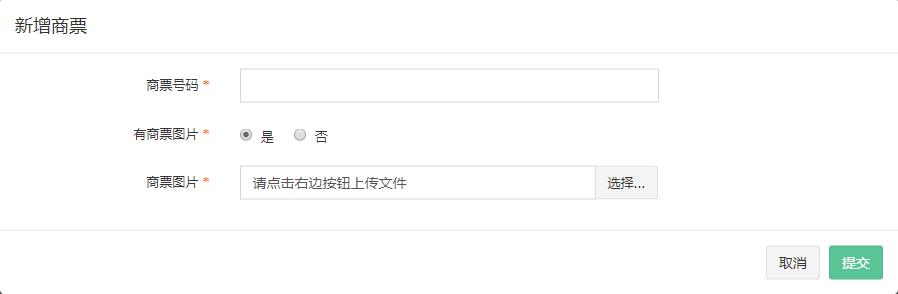
> 
> 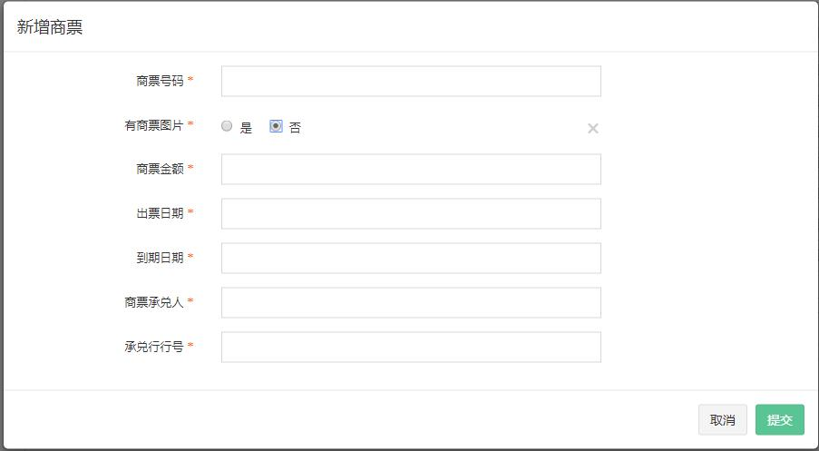
> 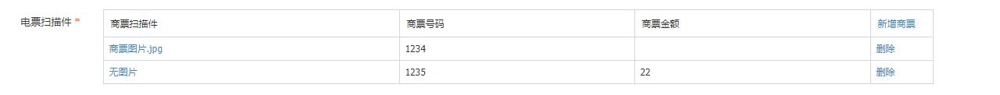

> **type:** contract
> 
> **描述：** 编辑合同，在options里面配置，该checker项的mode为edit，ref为获取begin中的合同信息，{"mode":"edit","ref":"@begin.contractFile"}
> 
> **关键字：** 合同、编辑
> 
> **所在页面：** 平台补录
> 
> **截图：** 
> 
> 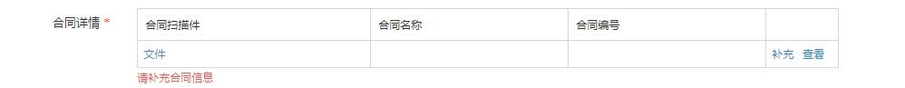
> 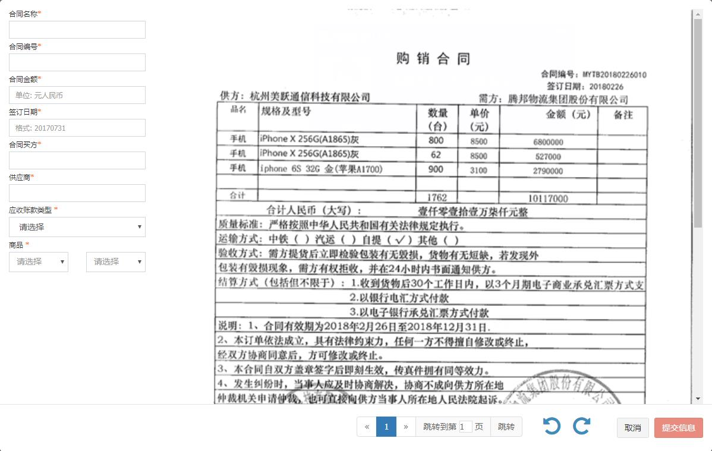
> 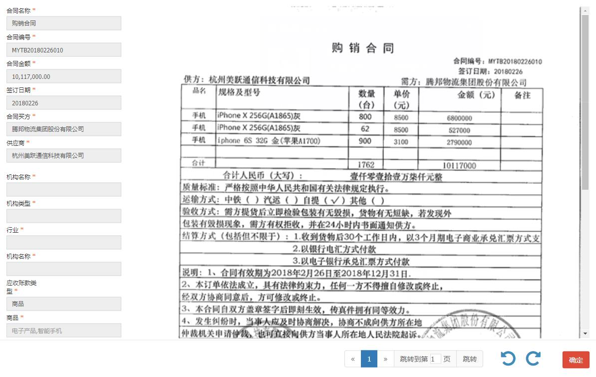
> 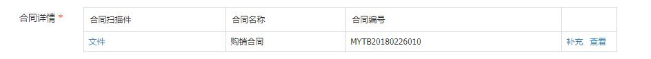

> **type:** invoice
> 
> **描述：** 补录发票
> 
> **关键字：** 发票、补录
> 
> **所在页面：** 平台补录
> 
> **截图：** 
> 
> 
> 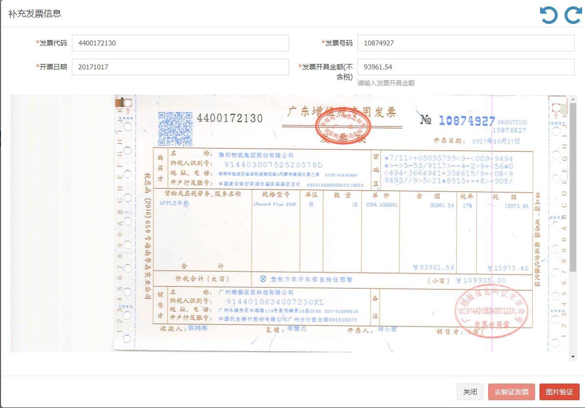
> 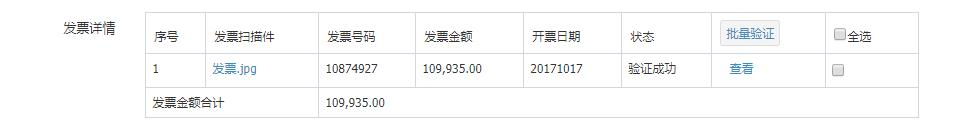

> **type:** honour
> 
> **描述：** 补录商票
> 
> **关键字：** 商票、补录
> 
> **所在页面：** 平台补录
> 
> **截图：** 
> 
> 
> 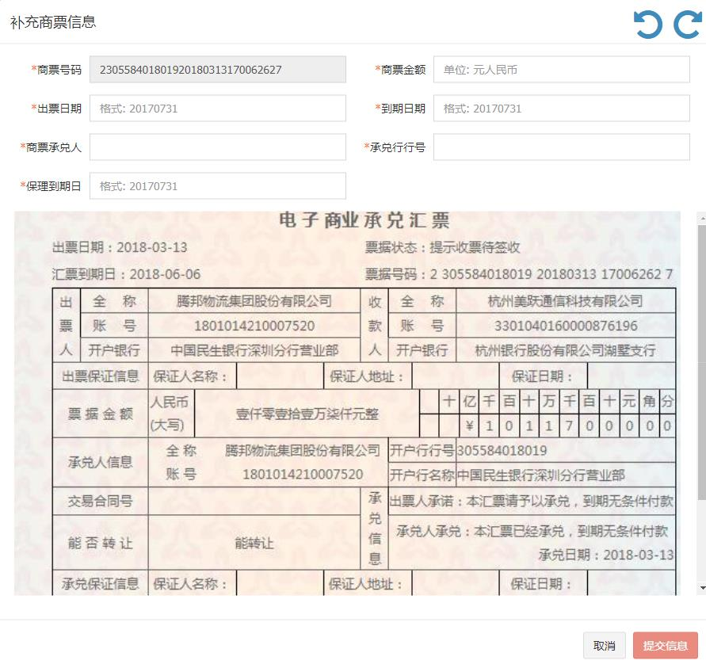
> 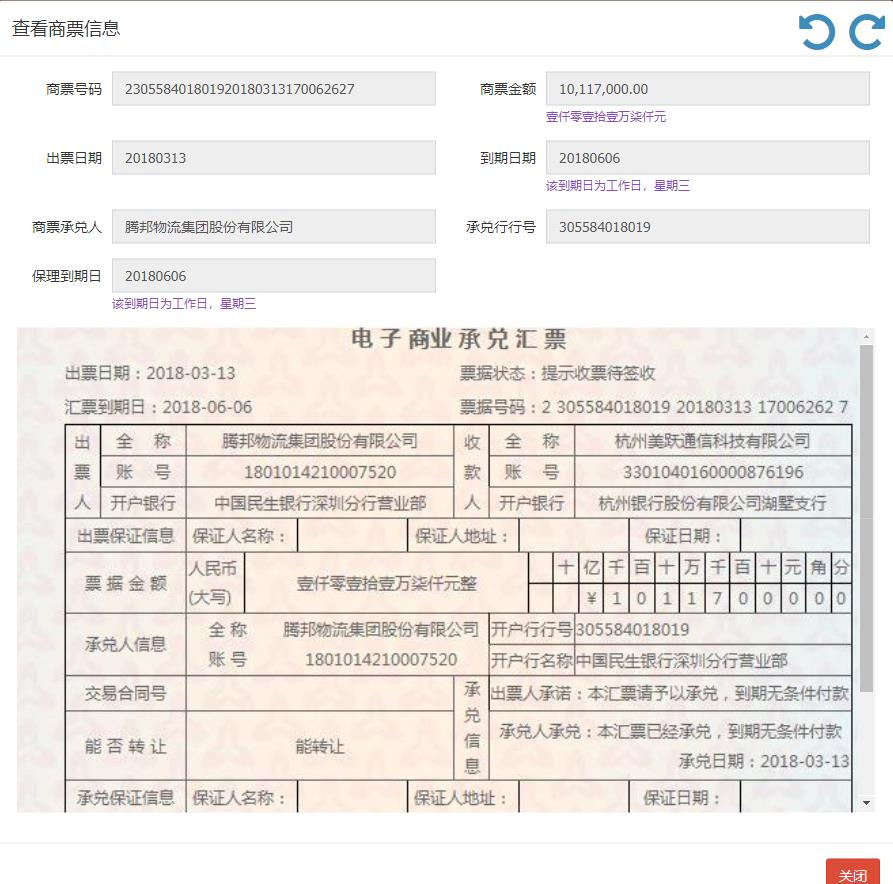
> 

-------------------------------------------------------------------------

> **type:** picker
> 
> **描述：** 选择某一种企业信息（如选择核心企业，保理商，供应商等）
> 
> **关键字：** 选择核心企业，选择保理商，选择供应商
> 
> **所在页面：** 基础模式+委托模式+回购模式，发起交易
> 
> **截图：** 
> 
> 
> 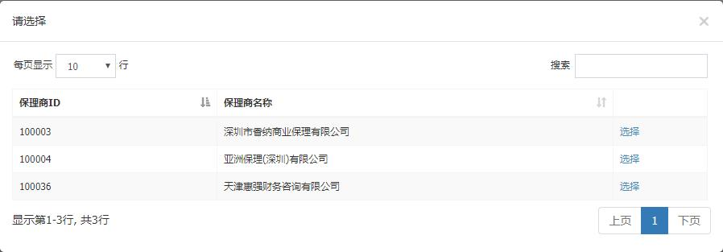
> 

> **type:** picker
> 
> **描述：** 选择弹框中的某一项，可以顺便填写以下的项，场景如：选择了银行账号，就能自动填充该账号的开户银行。在options里面配置{"change":"supplierBank"}
> 
> **关键字：** 选择，自动填充
> 
> **所在页面：** 基础模式+委托模式+回购模式，发起交易
> 
> **截图：** 
> 
> 
> 
> 

-------------------------------------------------------------------------

> **type:** select
> 
> **描述：** select下拉框
> 
> **关键字：** select、下拉框
> 
> **所在页面：** 基础模式+委托模式+回购模式，保理商审批并签署合同
> 
> **截图：** 
> 
> 
> 
> 

> **type:** date
> 
> **描述：** 日期选择框
> 
> **关键字：** 日期选择框
> 
> **所在页面：** 基础模式+委托模式+回购模式，保理商审批并签署合同
> 
> **截图：** 
> 
> 
> 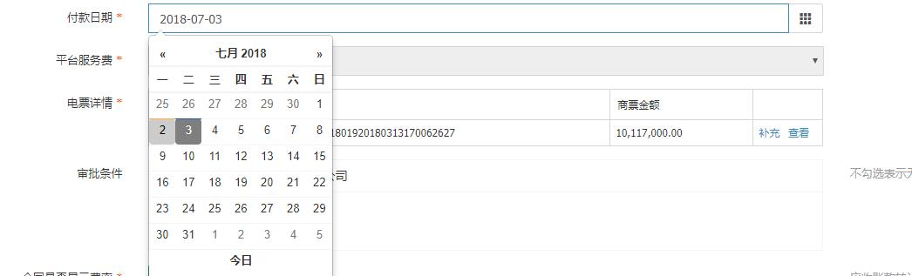
> 

> **type:** conditions
> 
> **描述：** 条件选择框
> 
> **关键字：** 条件选择框
> 
> **所在页面：** 基础模式+委托模式+回购模式，保理商审批并签署合同
> 
> **截图：** 
> 
> 
> 

> **type:** switch
> 
> **描述：** 按钮开关
> 
> **关键字：** 按钮开关
> 
> **所在页面：** 基础模式+委托模式+回购模式，保理商审批并签署合同
> 
> **截图：** 
> 
> 

------------------------------------------------------------

> **type:** bill
> 
> **描述：** 企业发票
> 
> **关键字：** 企业发票，补录企业发票（这里是企业如果需要开发票，则要补录，否则不用）
> 
> **所在页面：** 基础模式+委托模式+回购模式，供应商确认并签署合同
> 
> **截图：** 
> 
> 
> 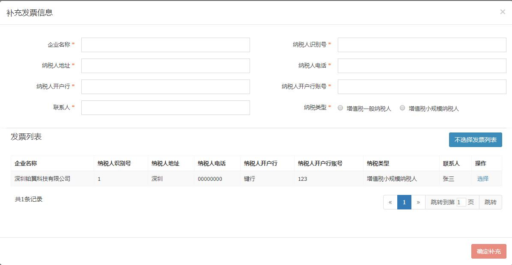
> 

---------------------------------------------------------------------

> **type:** date2
> 
> **描述：** 时间选择框带时分秒
> 
> **关键字：** 时间选择、时、分、秒
> 
> **所在页面：** 基础模式+委托模式+回购模式，保理商放款
> 
> **截图：** 
> 
> 
> 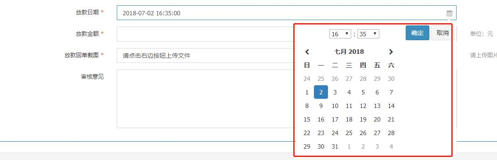

> **type:** money
> 
> **描述：** 金额大写
> 
> **关键字：** 金额，大写
> 
> **所在页面：** 基础模式+委托模式+回购模式，保理商放款
> 
> **截图：** 
> 
> 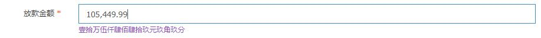

---------------------------------------------------------------------

> **type:** mselect
> 
> **描述：** 下拉改变其他checker项的值
> 
> **关键字：** 联动、下拉
> 
> **所在页面：** 审核机构注册
> 
> **截图：** 
> 
> 
> 
> 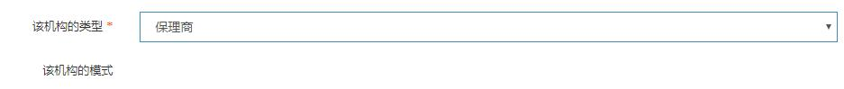

> **type:** dselect
> 
> **描述：** 联动下拉选择
> 
> **关键字：** 联动、下拉
> 
> **所在页面：** 审核机构注册
> 
> **截图：** 
> 
> 
> 
> 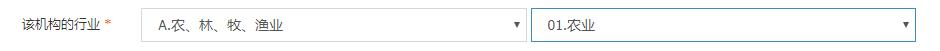

------------------------------------------------------------

> **type:** checkbox
> 
> **描述：** 多选框
> 
> **关键字：** 多选框
> 
> **所在页面：** 用户管理
> 
> **截图：** 
> 
> 