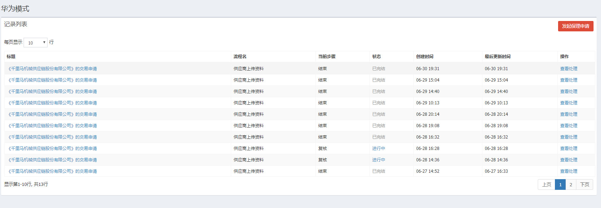
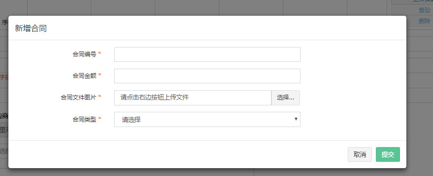
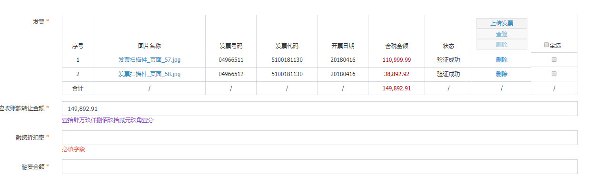
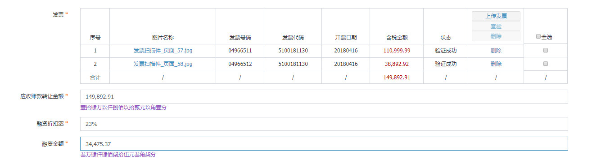
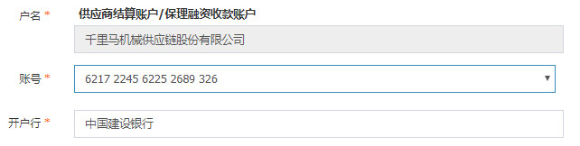
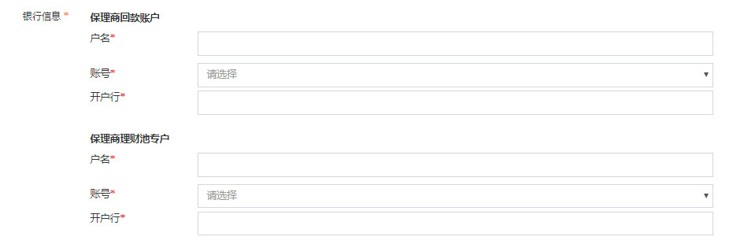
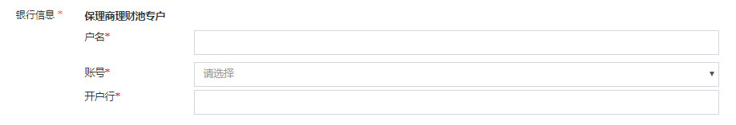
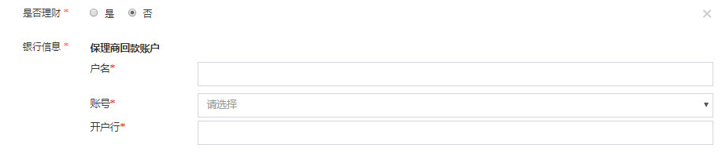

># 定向保理 - 华为模式
> ##### **所在页面：** 华为模式-记录列表
>
> **描述：** 记录交易
>
> **操作：** `发起保理申请` 原理同 `万科abs组件`中列表配置
>
> **截图：**
>
> 
>
> **type:** `date`
>
> **描述：** `保理到期日` 根据 `应收账款到期日`选择日期延后2天，遇假期累加顺延。`宽限期到期日`待定。
>
> **截图：**
>
> 
>
> **type:** `contract-hw`
>
> **描述：** 新增合同，可多分合同逐步上传补充
>
> **操作：** 
> 1. `新增合同`弹出合同新增合同信息填写弹框
> 2. `删除` 删除该条合同,并且改变`履约证明文件`的显示状态
> 3. `编辑` 可修改已上传合同资料
> 4. 点击图片文件可查看合同信息,显示效果同 `万科abs`组件合同显示
>
> **截图：**
> 
> 
>
> **新增合同**
>
> 
>
> **新增合同列表**
>
> 
>
> **type:** `money`
>
> **描述：** `应收账款转让金额` 根据上传发票计算的总额自动填充，`融资折扣率` 手动输入`（0~95）%`之间，在输入整数后组件失去焦点自动补充`%`,并根据`应收账款转让金额`与`融资折扣率`乘积计算`融资金额`
>
> **截图：**
>
> 
>
> 
>
>
> **type:** `mul-select`
>
> **描述：** 根据上传的合同类型显示不同的 `履约证明文件`，如有多个合同且存在不同的合同类型，显示多个`履约证明文件`
>
> **截图：**
>
>
> **合同类型为商品**
>
> 
>
> 
>
> **合同类型为服务**
>
> 
>
> 
>
> **同时存在两种类型**
>
> 
>
> 
>
> **type:** `hw-text`
>
> **描述：**  普通文本框，此业务下为不可编辑。设置同上。
>
> ** 截图：**
>
> 
>
> **type:** `edit-select`
>
> **描述：** 可编辑下拉选项，选定后根据所选项，自填充 `户名`、`开户行`。选项值获取 `api/jzn/bank_card/get`获取。可在`我的资料` `银行账号管理`来添加新的账号
>
> **截图：**
>
>  
>
> **组件交互截图：**  *注  该组件待替换type `bank-single`
>
> 
>
> ##### **所在页面：** 供应商复核
>
> **type:** `hw-text`
>
> **描述：** 显示账户户名
>
> 
>
> **生成合同并修改**  根据 `flowId` `financing10` 配置。生成，签署合同同 `万科abs`合同配置同原理。
>
> ##### **所在页面：** 保理商审核资料
>
> **type:** `contract-hw`
>
> **描述：** 静态显示合同，点击文件名称可查看合同信息
>
> **截图：**
>
> 
>
> **获取合同并签署**  根据`flowId` `financing_factoring10` 配置，获取供应商签署的合同。原理同`万科abs`。`同意`进入银行签署协议。
>
> ##### **所在页面：** 银行签署协议 `18966666666`
> **描述：**  下载 `供应商` `保理商` 签署的 `账户托管协议`,线下签署，并上传
> 
> **操作：**
> 1. 下载合同： `api/contract/pdf` `参数 id、secret、label`
>
> 
>
>##### **所在页面：** 保理商放款
>
> **type:** `radio`
>
> **描述：** 单选项
>
> **截图：**
>
> 
>
> **type:** `bank-input`
>
> **描述：** 银行卡信息。数据获取，添加新卡信息原理同上
>
> **截图：**
>
> 
>
> **操作：**  `是否理财`选项结果改变，`银行信息`组件显示效果，`账号`选择后自填充 `户名` `开户行`
> 
> **`是`** 选择理财，显示 `保理商理财池专户`
>
> 
>
> **`否`** 选择不理财，显示 `保理商回款账户`
>
> 
>
> **type:** `bank-input`
>
> **截图：**
>
> 
>
> **合同生成与签署**  根据 `flowId` `financing_loan10` 配置。
>
> ##### **所在页面：** 供应商确认收款
>
> **合同生成与签署**  根据 `flowId` `financing_loan_confirm10`配置。
>
>
>
>
>
>
>
>
>
>
>
>
>
>
>
>
>
>
>
>
>
>
>
>
>
>
>
>
>
>
>
>
>
>
>
>
>
>
>
>
>
>
>
>
>
