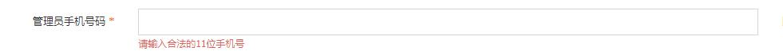
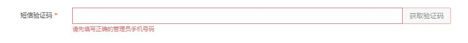
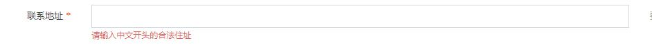
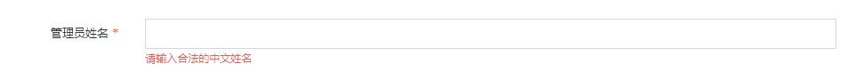
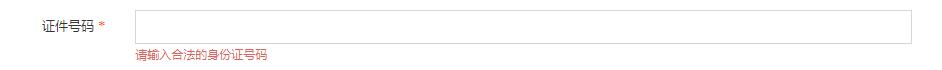
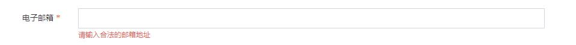

# 链融网站通用组件（校验类型）

> **type:** insName
> 
> **描述：** 校验公司名称，最短为4个中文
> 
> **关键字：** 校验，公司名称
> 
> **所在页面：** 注册页面
> 
> **截图：** 
> 
> 

> **type:** mobile
> 
> **描述：** 校验手机号，校验联通，电信，移动
> 
> **关键字：** 校验，手机号
> 
> **所在页面：** 注册页面
> 
> **截图：** 
> 
> 

> **type:** sms
> 
> **描述：** 校验短信验证码-关联了手机号（是否输入了手机号码）
> 
> **关键字：** 校验，手机号
> 
> **所在页面：** 注册页面
> 
> **截图：** 
> 
> 

> **type:** insAddr
> 
> **描述：** 校验地址-6位以上
> 
> **关键字：** 校验，地址
> 
> **所在页面：** 注册页面
> 
> **截图：** 
> 
> 

> **type:** cnName
> 
> **描述：** 校验姓名-两个以上中文姓名，外国翻译过来的中文姓名很长，而且有个·
> 
> **关键字：** 校验，姓名
> 
> **所在页面：** 注册页面
> 
> **截图：** 
> 
> 

> **type:** card
> 
> **描述：** 校验身份证（15位，18位，17位+Xx）
> 
> **关键字：** 校验，身份证
> 
> **所在页面：** 注册页面
> 
> **截图：** 
> 
> 

> **type:** email
> 
> **描述：** 校验电子邮箱
> 
> **关键字：** 校验，电子邮箱
> 
> **所在页面：** 注册页面
> 
> **截图：** 
> 
> 