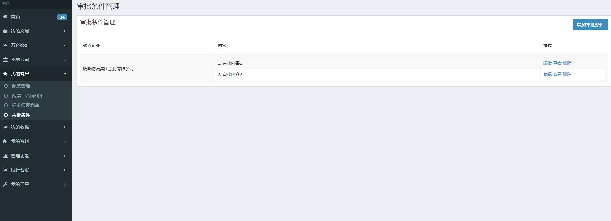
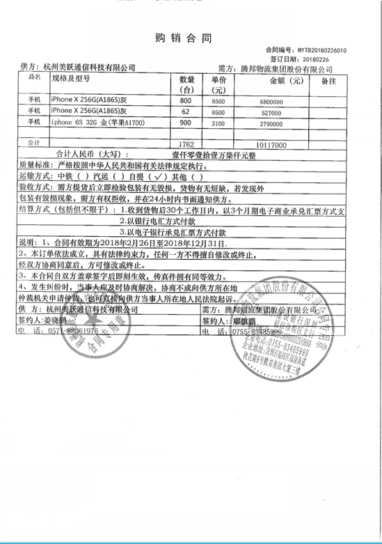

> # 基础模式

> ### **业务背景:** 通过两票一合同（商票、发票、合同）的方式，基于真实的交易背景，解决上游供应商的融资问题

> ### **参与方:** 核心企业，供应商，保理商，平台

> ### **参与方作用:** 
> 1.核心企业：核心企业将开出的商票在平台进行登记，保理商最后根据供应商拿来融资的商票找核心企业收款  
> 2.供应商：拿着核心企业开出的商票到保理商进行保理  
> 3.保理商：提供给供应商保理  
> 4.平台：审核出票登记，审核供应商申请的资料

> ### **业务场景:**  某核心企业（大公司在供应链中占支配地位，称核心企业，核心企业就是很大的公司）跟上游供应商购买了一批苹果手机，价值1个亿。上游供应商发货，核心企业给上游供应商开出了一张半年后兑现的票据金额为1个亿的商业承兑汇票。因为这张商票是由核心企业开出的（大公司开的票有保障，到期直接拿票找该企业兑付，信得过），这时如果上游供应商急需周转资金的话，便可以提供该笔交易的入库出库单，发票，买卖双方签订的合同等资料，拿着这张商票到保理商进行保理，用于转销该笔交易的应收账款。

> ### **业务流程：** 
> 

> ### **主流程** 
>> 授信 -> 出票登记 -> 平台审核出票登记
>>> 申请保理 -> 平台处理申请资料 -> 保理商审批并签署合同 -> 申请企业确认并签署合同 -> 保理商放款 -> 申请企业回款处理 -> 保理商收款登记 -> 交易完成

> ### 1. **授信** 
> ### 简介:
>> 保理商授予核心企业保理融资额度
>>> 

> ### 2. **出票登记** 
> ### 简介:
>> 核心企业将其开给上游供应商的商票在系统进行登记（经办->复核）
>>> 
>> ### 注意
>>> 仓单运单和发票至少为二选一

> ### 3.**平台审核出票登记** 
> ### 简介:
>> 平台审核出票登记（经办->复核）
>>> 

> ### 1.**申请保理** 
> ### 简介:
>> 供应商发起融资申请（经办->复核）
>>> 

> ### 2.**平台处理申请资料** 
> ### 简介:
>> 平台处理申请资料（经办->复核）
>> 应收账款类型有商品、服务、出租资产
>> 
>>> 复核的时候需要把商票再检查一遍，防止填错
>>> 

> ### 3.**保理商审批并签署合同** 
> ### 简介:
>> 保理商审批并签署合同（经办->复核->高级复核）
>> 利息方式有利息前置（发放融资款时一次扣收），利息后置（融资期间分次收取）
>> 审批条件如有则需勾选，如无则不必
>> 
>>> 复核的时候需要把商票再检查一遍，防止填错
>>> 
>>>> 复核的时候需要把商票再检查一遍，防止填错
>>>> 
>>>>> 审批条件管理面板
>>>>> 

>签署《国内商业保理合同》 《应收账款转让申请暨确认书》
>《国内商业保理合同》（无追索权）
> 无追索权: 一般而言，在债务人信用风险(即无力支付或破产、清盘等情况下)时放弃追索权
>
>
>
>《应收账款转让申请暨确认书》
> 该确认书中记录：1保理业务类型，2、转让价款及保理期限（转让价款实际上为应收账款减去利息），3、保理款用途：默认用途为转销应收款
> 

> ### 4.**申请企业确认并签署合同** 
> ### 简介:
>> 申请企业确认并签署合同（经办->复核）
>>> 
>>>签署《国内商业保理合同》 《应收账款转让申请暨确认书》
>>>因为合同指向的是同一份合同，所以当申请企业盖完章后，保理商查看自己签署的合同的时候，也能看到申请企业盖的章。

> ### 5.**保理商放款** 
> ### 简介:
>> 保理商放款（经办->复核）
>>> 
>>> 
>>>签署《保理转让价款付款通知书》
>>> 
>>>因为合同指向的是同一份合同，所以当申请企业盖完章后，保理商查看自己签署的合同的时候，也能看到申请企业盖的章。

> ### 6.**申请企业回款处理** 
> ### 简介:
>> 申请企业回款处理（经办->复核）
>> 申请企业收到款项后，将商票背书转让给保理商
>>> 
>>>签署《间接回款通知书暨确认书》
>>> 
 
> ### 7.**保理商接受回款** 
> ### 简介:
>> 保理商接受回款（经办->复核）
>>> 
>>>签署《间接回款通知书暨确认书》
>>> 

> ### 8.**收款登记** 
> ### 简介:
>> 收款登记（经办->复核）
>>> 
>>> 
>>>查看《间接回款通知书暨确认书》
>>> 
>  
>
## **两票一合同:** 商票、发票、合同
> 
> 
> 

