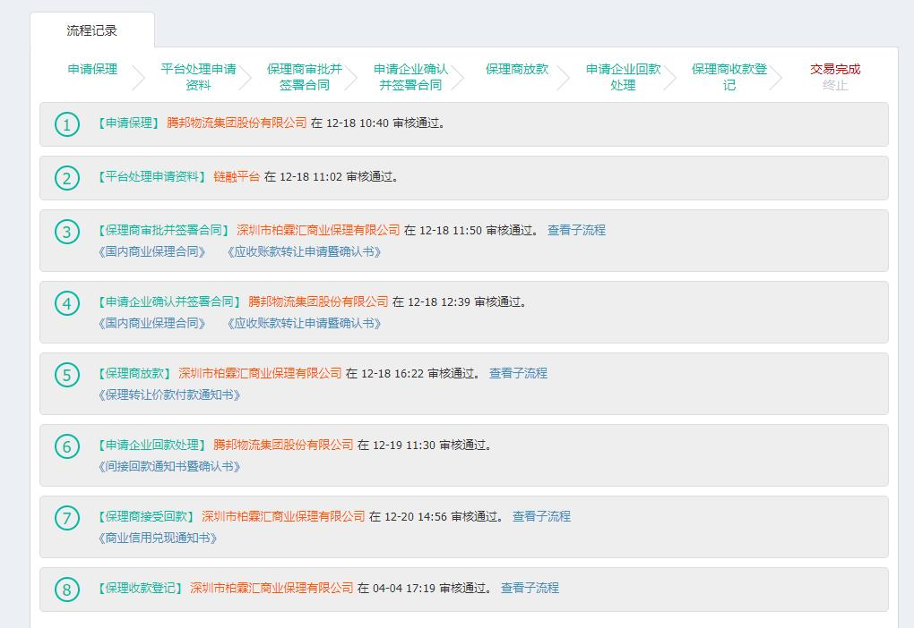
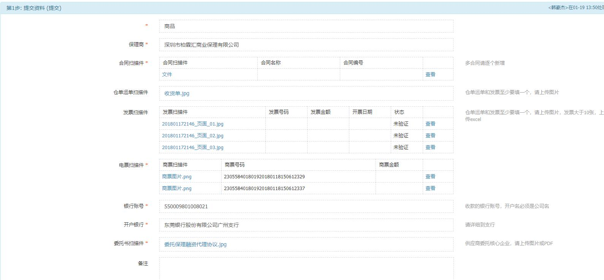
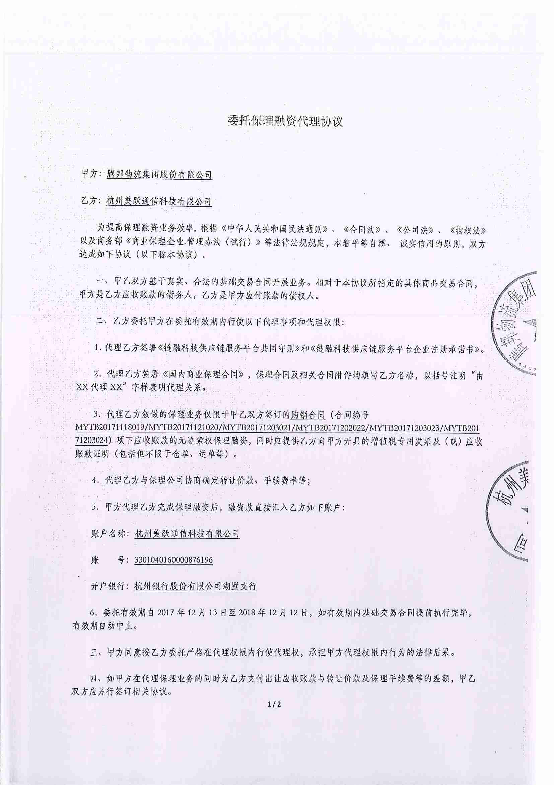

# 委托模式

> ### **业务背景:** 通过两票一合同（商票、发票、合同）的方式，基于真实的交易背景，解决上游供应商的融资问题（比如该供应商未在平台注册，只能委托核心企业进行融资）

> ### **参与方:** 核心企业，供应商，保理商，平台

> ### **参与方作用:** 
> 1.核心企业：核心企业将开出的商票在平台进行登记，保理商最后根据供应商拿来融资的商票找核心企业收款  
> 2.供应商：委托核心企业，让其拿着自己开出的商票到保理商进行保理  
> 3.保理商：提供给供应商保理  
> 4.平台：审核出票登记，审核核心企业受供应商委托提供申请的资料

> ### **业务场景:**  某核心企业（大公司在供应链中占支配地位，称核心企业，核心企业就是很大的公司）跟上游供应商购买了一批苹果手机，价值1个亿。上游供应商发货，核心企业给上游供应商开出了一张半年后兑现的票据金额为1个亿的商业承兑汇票。因为这张商票是由核心企业开出的（大公司开的票有保障，到期直接拿票找该企业兑付，信得过），这时如果上游供应商急需周转资金的话，便可以提供该笔交易的入库出库单，发票，买卖双方签订的合同等资料，委托核心企业拿着这张商票到保理商进行保理，用于转销该笔交易的应收账款。

> ### **业务流程：** 
> 

> ### **主流程** 
>> 授信 -> 出票登记 -> 平台审核出票登记
>>> 申请保理 -> 平台处理申请资料 -> 保理商审批并签署合同 -> 申请企业确认并签署合同 -> 保理商放款 -> 申请企业回款处理 -> 保理商收款登记 -> 交易完成

> ### **业务流程：** 
> 1.核心企业发起申请  
> 
> 