# 链融网站通用组件

> **type:** bank-honour
> 
> **描述：** 上传电票扫描件
> 
> **关键字：** 电票扫描件、上传
> 
> **所在页面：** 保理保证 流程步骤1： 供应商发起交易页面上传电票扫描件
> 
> **截图：** 
> 
> 
> 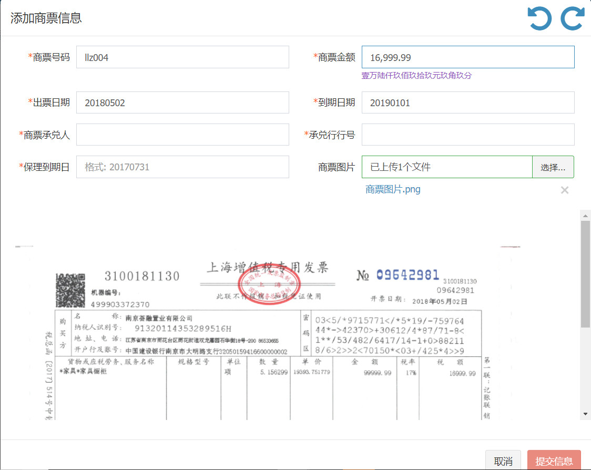
> 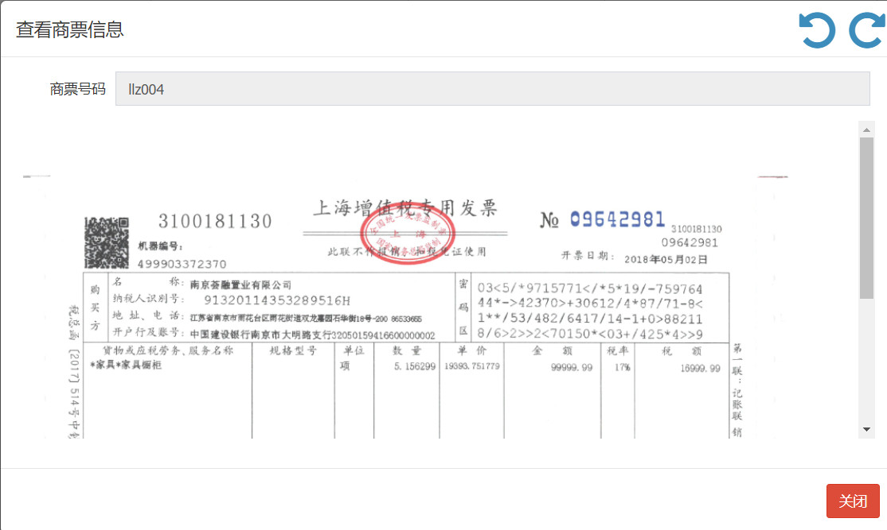

> **type:** bank-contract
> 
> **描述：** 上传合同扫描件
> 
> **关键字：** 合同扫描件、上传
> 
> **所在页面：** 保理保证 流程步骤1： 供应商发起交易页面上传合同扫描件
> 
> **截图：** 
> 
> 
> 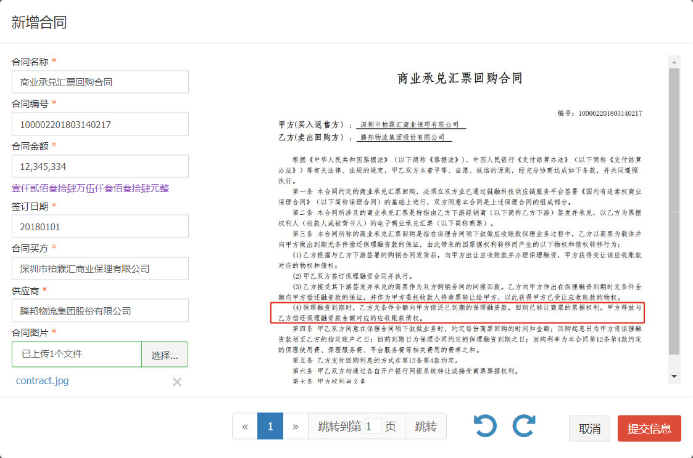
> 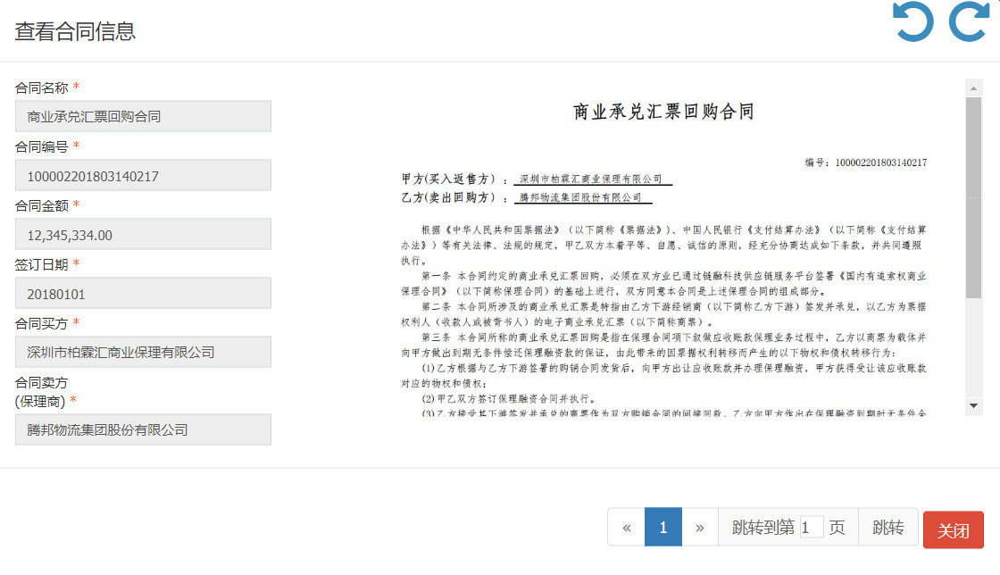

> **type:** bank-invoice
> 
> **描述：** 上传发票扫描件
> 
> **关键字：** 发票扫描件、上传
> 
> **所在页面：** 保理保证 流程步骤1： 供应商发起交易页面上传发票扫描件
> 
> **截图：** 
> 
> 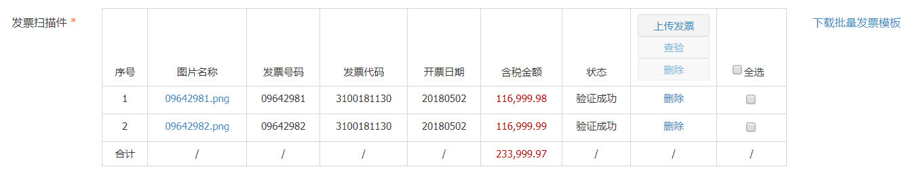

> **type:** select
> 
> **描述：** 选择保理商
> 
> **关键字：** 选择保理商、单选
> 
> **所在页面：** 保理保证 流程步骤1： 供应商发起交易页面选择保理商
> 
> **截图：** 
> 
> 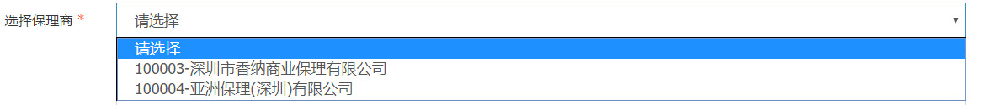

> **type:** factoring-list
> 
> **描述：** 保理商详情
> 
> **关键字：** 保理商详情、列表
> 
> **所在页面：** 保理保证 流程步骤1： 供应商发起交易页面
> 
> **截图：** 
> 
> 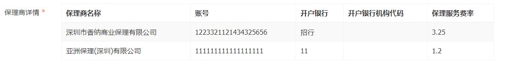

> **type:** bank-list
> 
> **描述：** 融资银行详情
> 
> **关键字：** 融资银行详情、列表
> 
> **所在页面：** 保理保证 流程步骤1： 供应商发起交易页面
> 
> **截图：** 
> 
> 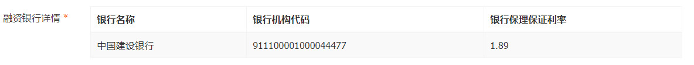

> **type:** file-consistency
> 
> **描述：** 扫描文件的一致性检查
> 
> **关键字：** 扫描文件的一致性检查、一致性
> 
> **所在页面：** 保理保证 流程步骤2： 平台初审页面
> 
> **截图：** 
> 
> 

> **type:** file-logical
> 
> **描述：** 交易逻辑性检查
> 
> **关键字：** 交易逻辑性检查
> 
> **所在页面：** 保理保证 流程步骤2： 平台初审页面
> 
> **截图：** 
> 
> 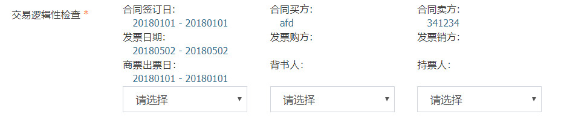

> **type:** mfile
> 
> **描述：** 商票背书截屏
> 
> **关键字：** 商票背书截屏、上传
> 
> **所在页面：** 保理保证 流程步骤4： 供应商初审页面
> 
> **截图：** 
> 
> 
> 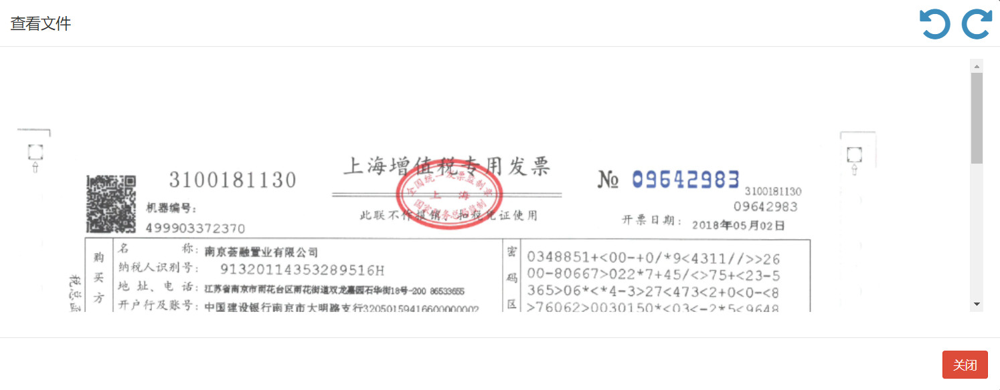

> **type:** sign-contracts
> 
> **描述：** 需要签署的合同
> 
> **关键字：** 需要签署的合同、合同
> 
> **所在页面：** 保理保证 流程步骤5： 银行初审页面
> 
> **截图：** 
> 
> 
> 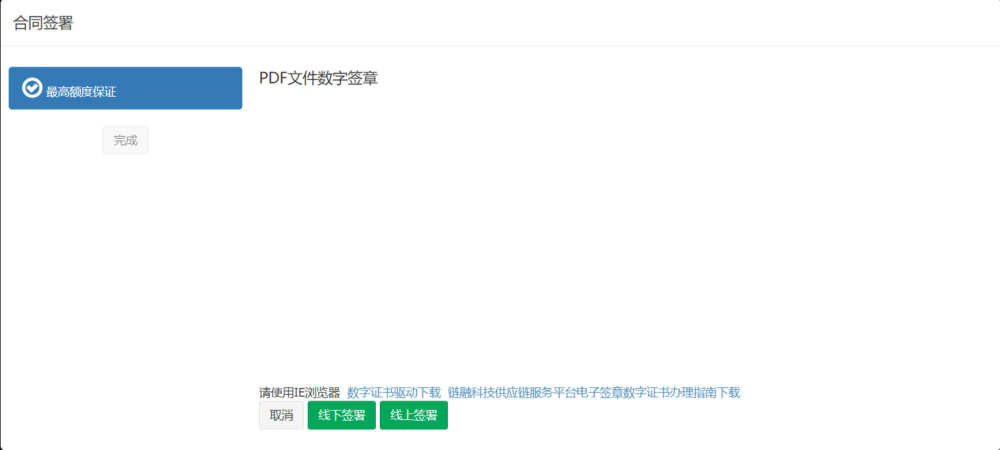

> **type:** 
> 
> **描述：** 
> 
> **关键字：** 
> 
> **所在页面：**
> 
> **截图：** 
> 
> 